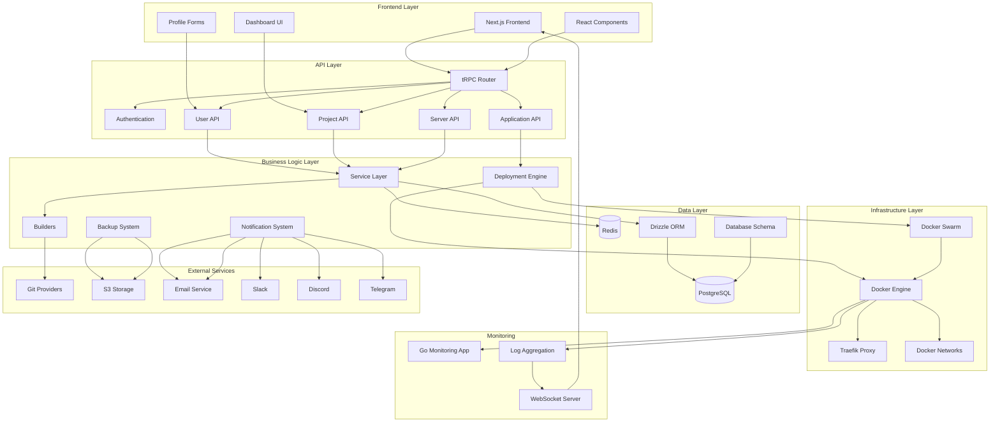

# Dokploy System Architecture Overview

## System Architecture Diagram



## Key Lifecycle Files

### 1. Application Startup Lifecycle
- **Entry Point**: `apps/dokploy/server/server.ts`
- **Setup**: `apps/dokploy/setup.ts`
- **Initialization Order**:
  1. Environment configuration
  2. Next.js app preparation
  3. HTTP server creation
  4. WebSocket servers setup
  5. Database migration
  6. Docker Swarm initialization
  7. Network setup
  8. Traefik configuration
  9. Cron jobs initialization
  10. Deployment worker startup

### 2. User Authentication Lifecycle
- **Entry Point**: `apps/dokploy/server/api/routers/user.ts`
- **Components**:
  - User registration/login
  - Session management
  - Organization membership
  - Permission validation
  - Profile updates

### 3. Application Deployment Lifecycle
- **Entry Point**: `apps/dokploy/server/api/routers/application.ts`
- **Components**:
  - Project creation
  - Application configuration
  - Build process
  - Docker container deployment
  - Service management
  - Health monitoring

### 4. Database Management Lifecycle
- **Schema**: `packages/server/src/db/schema/`
- **Migration**: `apps/dokploy/server/db/migration.ts`
- **Components**:
  - Schema definitions
  - Data validation
  - Relationship management
  - Query optimization

## Technology Stack

### Frontend
- **Framework**: Next.js 14 with App Router
- **UI Library**: React with TypeScript
- **Styling**: Tailwind CSS
- **State Management**: tRPC with React Query
- **Forms**: React Hook Form with Zod validation

### Backend
- **Runtime**: Node.js with TypeScript
- **API**: tRPC for type-safe APIs
- **Database**: PostgreSQL with Drizzle ORM
- **Cache**: Redis for session management
- **Authentication**: Custom auth with bcrypt

### Infrastructure
- **Containerization**: Docker & Docker Swarm
- **Proxy**: Traefik for load balancing
- **Monitoring**: Custom Go application
- **File Storage**: S3-compatible storage

### External Integrations
- **Git**: GitHub, GitLab, Bitbucket, Gitea
- **Notifications**: Email, Slack, Discord, Telegram
- **Payments**: Stripe (cloud version)
- **Storage**: S3-compatible services

## Data Flow Patterns

### 1. User Profile Update Flow
```
Frontend Form → tRPC Mutation → User API → Database Update → Cache Invalidation → UI Refresh
```

### 2. Application Deployment Flow
```
Project Creation → Application Config → Build Process → Docker Deploy → Health Check → Monitoring
```

### 3. Notification Flow
```
Event Trigger → Notification Service → Channel Selection → Message Delivery → Status Update
```

## Security Architecture

### Authentication
- Session-based authentication
- JWT tokens for API access
- Role-based access control (RBAC)
- Organization-level permissions

### Data Protection
- Password hashing with bcrypt
- SQL injection prevention via ORM
- Input validation with Zod schemas
- CORS configuration

### Infrastructure Security
- Docker container isolation
- Network segmentation
- SSL/TLS termination at Traefik
- Environment variable management

## Scalability Considerations

### Horizontal Scaling
- Docker Swarm for container orchestration
- Multiple server support
- Load balancing via Traefik
- Redis clustering support

### Performance Optimization
- Database query optimization
- Redis caching layer
- WebSocket for real-time updates
- Static asset optimization

### Monitoring & Observability
- Custom metrics collection
- Log aggregation
- Health check endpoints
- Performance monitoring
