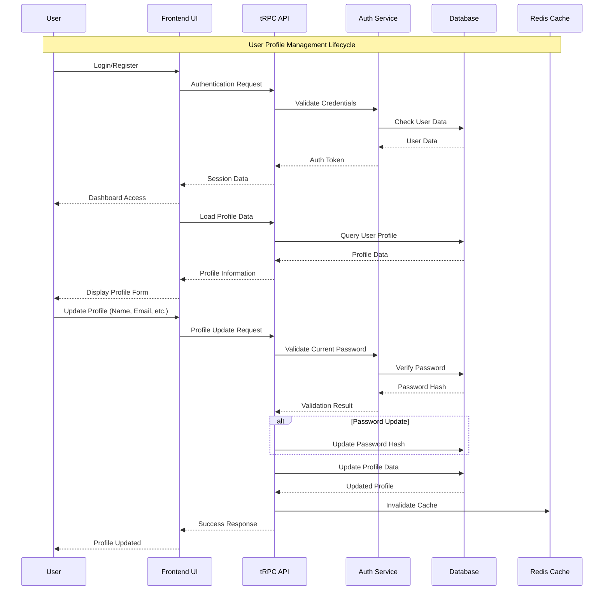

# User Profile Management Lifecycle

## Overview
This document outlines the complete lifecycle of user profile management in Dokploy, including authentication, profile updates, and UI integration.

## Lifecycle Flow



## Key Components

### 1. Frontend Components

#### Profile Form (`apps/dokploy/components/dashboard/settings/profile/profile-form.tsx`)
```typescript
// Form schema with validation
const profileSchema = z.object({
    name: z.string().optional(),           // ✅ NEW: User name field
    email: z.string(),
    password: z.string().nullable(),
    currentPassword: z.string().nullable(),
    image: z.string().optional(),
    allowImpersonation: z.boolean().optional().default(false),
});

// Form submission handler
const onSubmit = async (values: Profile) => {
    await mutateAsync({
        name: values.name || undefined,    // ✅ NEW: Include name in update
        email: values.email.toLowerCase(),
        password: values.password || undefined,
        image: values.image,
        currentPassword: values.currentPassword || undefined,
        allowImpersonation: values.allowImpersonation,
    });
};
```

#### User Navigation (`apps/dokploy/components/layouts/user-nav.tsx`)
```typescript
// Display user name in sidebar
<span className="truncate font-semibold">
    {data?.user?.name || "Account"}  // ✅ NEW: Show name instead of "Account"
</span>

// Display user name in dropdown
<DropdownMenuLabel className="flex flex-col">
    {data?.user?.name || "My Account"}  // ✅ NEW: Show name in dropdown
    <span className="text-xs font-normal text-muted-foreground">
        {data?.user?.email}
    </span>
</DropdownMenuLabel>
```

### 2. Backend API

#### User Router (`apps/dokploy/server/api/routers/user.ts`)
```typescript
export const userRouter = createTRPCRouter({
    // Get current user data
    get: protectedProcedure.query(async ({ ctx }) => {
        return await findUserById(ctx.user.id);
    }),
    
    // Update user profile
    update: protectedProcedure
        .input(apiUpdateUser)  // Includes name field
        .mutation(async ({ input, ctx }) => {
            // Password validation logic
            if (input.password || input.currentPassword) {
                // Validate current password
                const currentAuth = await db.query.account.findFirst({
                    where: eq(account.userId, ctx.user.id),
                });
                const correctPassword = bcrypt.compareSync(
                    input.currentPassword || "",
                    currentAuth?.password || "",
                );
                
                if (!correctPassword) {
                    throw new TRPCError({
                        code: "BAD_REQUEST",
                        message: "Current password is incorrect",
                    });
                }
                
                // Update password
                await db.update(account)
                    .set({ password: bcrypt.hashSync(input.password, 10) })
                    .where(eq(account.userId, ctx.user.id));
            }
            
            // Update user profile
            return await updateUser(ctx.user.id, input);
        }),
});
```

### 3. Database Schema

#### User Schema (`packages/server/src/db/schema/user.ts`)
```typescript
export const users_temp = pgTable("user_temp", {
    id: text("id").notNull().primaryKey().$defaultFn(() => nanoid()),
    name: text("name").notNull().default(""),  // ✅ User display name
    email: text("email").notNull().unique(),
    emailVerified: boolean("email_verified").notNull(),
    image: text("image"),
    role: text("role").notNull().default("user"),
    // ... other fields
});

// API schema for updates
export const apiUpdateUser = createSchema.partial().extend({
    password: z.string().optional(),
    currentPassword: z.string().optional(),
    // ... other fields (name is included via createSchema.partial())
});
```

### 4. Authentication Flow

#### Session Management
1. **Login**: User provides credentials
2. **Validation**: Server validates against database
3. **Session Creation**: Server creates session with user ID
4. **Token Storage**: Session token stored in Redis
5. **UI State**: Frontend receives user data and updates UI

#### Profile Updates
1. **Form Submission**: User submits profile form
2. **Validation**: Frontend validates form data
3. **API Call**: tRPC mutation sent to backend
4. **Password Check**: If password change, validate current password
5. **Database Update**: Update user record in PostgreSQL
6. **Cache Invalidation**: Clear Redis cache
7. **UI Refresh**: Frontend updates with new data

## Data Flow Details

### Profile Data Loading
```typescript
// Frontend query
const { data, refetch, isLoading } = api.user.get.useQuery();

// Backend query
get: protectedProcedure.query(async ({ ctx }) => {
    return await findUserById(ctx.user.id);
});
```

### Profile Data Update
```typescript
// Frontend mutation
const { mutateAsync, isLoading: isUpdating } = api.user.update.useMutation();

// Backend mutation
update: protectedProcedure
    .input(apiUpdateUser)
    .mutation(async ({ input, ctx }) => {
        return await updateUser(ctx.user.id, input);
    });
```

### Form State Management
```typescript
// Form initialization
const form = useForm<Profile>({
    defaultValues: {
        name: data?.user?.name || "",        // ✅ Load existing name
        email: data?.user?.email || "",
        password: "",
        image: data?.user?.image || "",
        currentPassword: "",
        allowImpersonation: data?.user?.allowImpersonation || false,
    },
    resolver: zodResolver(profileSchema),
});

// Form reset on data change
useEffect(() => {
    if (data) {
        form.reset({
            name: data?.user?.name || "",    // ✅ Reset with name
            email: data?.user?.email || "",
            // ... other fields
        });
    }
}, [form, data]);
```

## Error Handling

### Validation Errors
- **Frontend**: Zod schema validation
- **Backend**: tRPC input validation
- **Database**: Constraint validation

### Authentication Errors
- **Invalid Password**: "Current password is incorrect"
- **Missing Password**: "New password is required"
- **Unauthorized**: "You are not authorized to access this resource"

### Network Errors
- **Connection Issues**: Retry logic with exponential backoff
- **Timeout**: User-friendly error messages
- **Server Errors**: Fallback to cached data when possible

## Security Considerations

### Password Security
- **Hashing**: bcrypt with salt rounds
- **Validation**: Current password verification required
- **Storage**: Never store plain text passwords

### Data Validation
- **Input Sanitization**: Zod schema validation
- **SQL Injection**: Prevented by Drizzle ORM
- **XSS Protection**: React's built-in escaping

### Session Security
- **Token Management**: Secure session tokens
- **Expiration**: Automatic session expiration
- **CSRF Protection**: Built into tRPC

## Performance Optimizations

### Caching Strategy
- **Redis Cache**: Session and user data caching
- **React Query**: Frontend data caching
- **Cache Invalidation**: Smart cache updates

### Database Optimization
- **Indexes**: Optimized database indexes
- **Query Optimization**: Efficient Drizzle queries
- **Connection Pooling**: Database connection management

### UI Performance
- **Form Optimization**: Debounced form updates
- **Lazy Loading**: Component lazy loading
- **Memoization**: React.memo for expensive components
